  

  
  

## Sobre mim

Sou engenheiro de IA e desenvolvo produtos, agentes e automações que transformam problemas reais da operação em soluções úteis para quem trabalha com elas todos os dias.

Minha trajetória começou em mídia paga, passou pela coordenação de performance e chegou à engenharia de IA. Isso me ajuda a conectar tecnologia, negócio e experiência do usuário — do entendimento do problema à integração, aos testes e à adoção da solução.

## O que venho construindo

- **Agentes de IA** que interpretam solicitações, escolhem ferramentas e consultam diferentes fontes antes de responder.
- **Automações e integrações** entre sistemas, APIs e fluxos operacionais.
- **Análises com LLMs** para apoiar decisões de performance em Meta Ads, Google Ads e GA4.
- **Produtos internos** desenvolvidos com validação contínua junto aos usuários.

| **+1.000 anúncios** | **+150 contas** | **~90% menos tempo** |
|:---:|:---:|:---:|
| publicados por automação | atendidas pela solução | em uma tarefa operacional |

## Tecnologias

  

 

`IA generativa` · `LLMs` · `Agentes de IA` · `Engenharia de prompts` · `APIs REST` · `Integração de sistemas` · `Testes` · `Revisão de PRs` · `Validação com usuários`

## Agora

Atualmente trabalho na evolução da **RAI**, plataforma interna da Reprotel que reúne dados, processos e ferramentas da operação. Meu foco é construir soluções de IA confiáveis, mensuráveis e simples de usar.

---

  Belém, Pará, Brasil · Aberto a trocar ideias sobre IA aplicada, agentes e automação.

